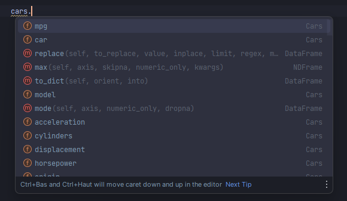
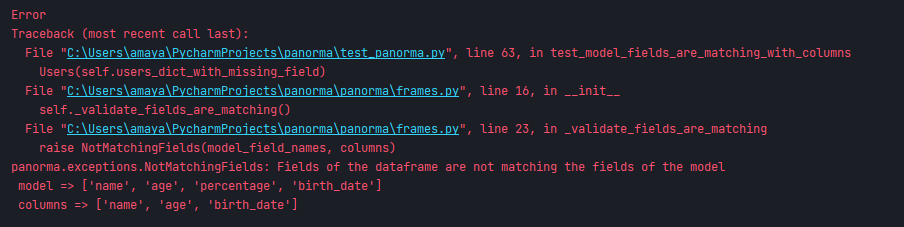
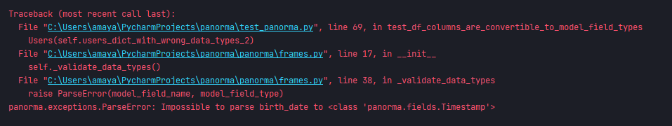

# Panorma
A lightweight Python package (just over 50 lines of code) that enables you to create typed 
models for Pandas DataFrames using classes. 

You can easily define  structured models, enforce column typing, 
enjoy autocompletion, and catch invalid column errors early in your DataFrame operations. 

Simplify your data modeling and enhance the reliability of your DataFrame workflows.

Installation:
- 
```shell script
  pip install panorma
```
or
```shell script
  poetry add panorma
```

Example:
-
- Create some models:
```python
from panorma.fields import String, Int, Float, DateTime, Categorical
from panorma.frames import DataFrame

class Users(DataFrame):
    name: String
    age: Int
    percentage: Float
    birth_date: DateTime


class Cars(DataFrame):
    car: String
    mpg: Float
    cylinders: Int
    displacement: Float
    horsepower: Float
    weight: Float
    acceleration: Float
    model: Int
    origin: Categorical
```

- Instantiate your models as you instantiate a simple pandas dataframe

```python
import pandas as pd

users = Users({
    "name": ['john', 'kevin'],
    "age": [99, 15],
    "percentage": [0.8, 7.3],
    "birth_date": [pd.Timestamp('20180310'), pd.Timestamp('20230910')],
})
cars = Cars(pd.read_csv('CAR_DATASET.csv'))
```

- You will get autocompletion for models columns and pandas at the same time


- If the columns of your data are not matching your model, you will get a NotMatchingFields exception:


- If a column cannot be cast to the type declared in the model, you will get a ParseError exception:
